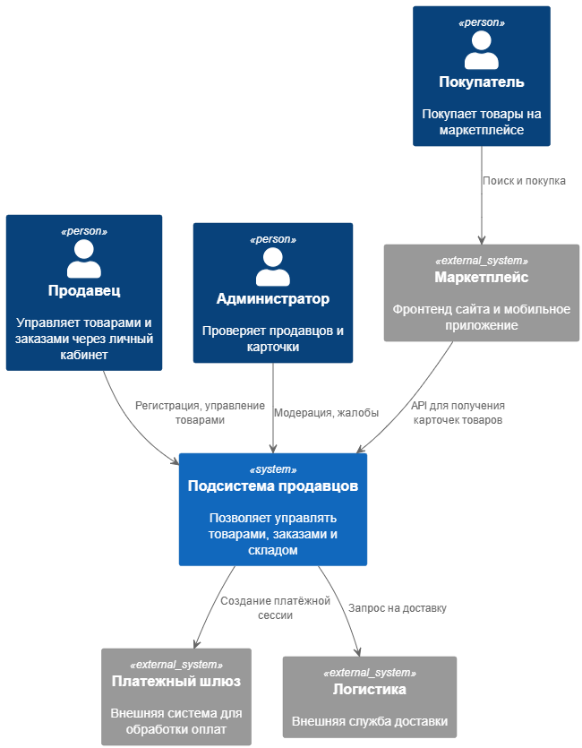
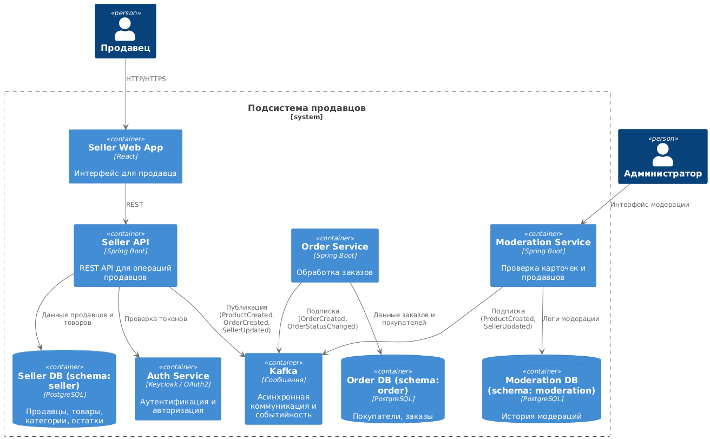

# Архитектура подсистемы продавцов маркетплейса

Документ описывает верхнеуровневую архитектуру системы в нотации C4. Архитектура разделена на два уровня:

- **Контекстная диаграмма (C4 level 1)** — окружение системы и взаимодействие с внешними участниками.
- **Диаграмма контейнеров (C4 level 2)** — основные подсистемы и сервисы внутри архитектуры.

---

## C4 Level 1 — Контекстная диаграмма

[Открыть PUML](https://github.com/Hilski/practice_ba/blob/main/architecture/C4L1)

---

## C4 Level 2 — Диаграмма контейнеров

[Открыть PUML](https://github.com/Hilski/practice_ba/blob/main/architecture/C4L2)

---

## Принципы архитектуры

- Архитектура основана на микросервисном подходе
- Все компоненты общаются через REST и события (Kafka)
- Аутентификация централизована через OAuth2
- Интеграции с внешними системами через адаптеры/шлюзы
- Данные хранятся в PostgreSQL с возможной декомпозицией по схемам/сервисам
- Используется Circuit Breaker, Retry, Logging (в проде)

---

## Безопасность и масштабирование

- Вся коммуникация — через HTTPS
- Используются роли: продавец, администратор, модератор
- Kafka обеспечивает масштабируемую очередь событий
- Горизонтальное масштабирование сервисов возможно через Kubernetes

---
