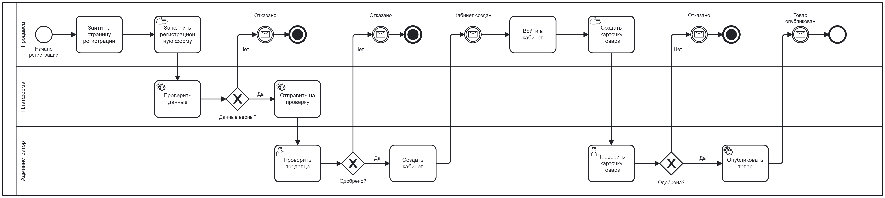

# Описание бизнес-процессов подсистемы продавцов маркетплейса

## Назначение подсистемы

Подсистема продавцов предназначена для обеспечения самостоятельной работы внешних поставщиков (продавцов) на маркетплейсе. Продавцы могут регистрироваться, размещать и управлять товарами, обрабатывать заказы, вести складской учёт и взаимодействовать с покупателями и администрацией платформы.

**Регистрация продавца и размещение товара**

[Открыть XML-файл](https://github.com/Hilski/practice_ba/blob/main/practice_ba.bpmn)

## Основные бизнес-процессы

### 1. Регистрация продавца

- Продавец переходит на страницу регистрации.
- Вводит контактные данные, ИНН, название компании, банковские реквизиты.
- Система валидирует данные.
- Администратор платформы проверяет данные (KYC/бэкграунд-чек).
- После подтверждения — продавец получает доступ к личному кабинету.

### 2. Размещение карточек товаров

- Продавец входит в личный кабинет.
- Переходит в раздел "Мои товары".
- Добавляет карточку товара: название, описание, фото, SKU, цену и категорию.
- Указывает склад и доступное количество.
- Товар сохраняется в черновиках.
- Администратор платформы (по необходимости) модераторски проверяет карточку.
- После одобрения карточка становится доступна для покупателей.

### 3. Управление остатками на складе

- Продавец заходит в раздел "Склад".
- Меняет количество товара (при поставке/распродаже).
- Система автоматически блокирует товар при нулевом остатке.
- Возможна массовая загрузка остатков через Excel/API.

### 4. Обработка заказов

- Покупатель оформляет заказ.
- Система направляет уведомление продавцу.
- Продавец подтверждает заказ и формирует отгрузку.
- Менеджер доставки забирает товар или продавец доставляет сам.
- Статус заказа обновляется: "Подтвержден" → "В пути" → "Доставлен".
- После подтверждения доставки — продавец получает выплату.

### 5. Взаимодействие с клиентами

- Покупатели могут задавать вопросы к товару.
- Продавец отвечает через интерфейс "Вопросы и ответы".
- В случае спора — покупатель может подать жалобу.
- Администрация подключается к урегулированию.

---