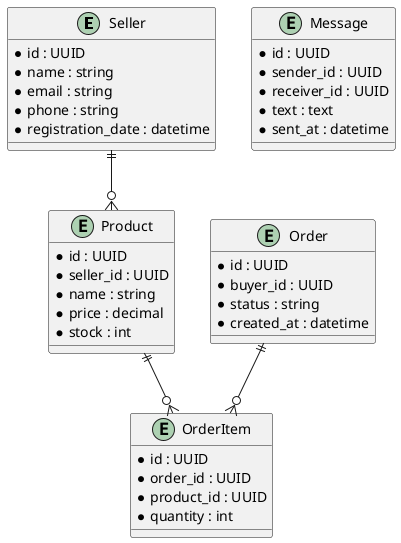

# 🗃 Модель данных

Диаграмма создана в нотации **PlantUML (IE)**

```plantuml
@startuml
entity Seller {
  * id : UUID
  * name : string
  * email : string
  * phone : string
  * registration_date : datetime
}

entity Product {
  * id : UUID
  * seller_id : UUID
  * name : string
  * price : decimal
  * stock : int
}

entity Order {
  * id : UUID
  * buyer_id : UUID
  * status : string
  * created_at : datetime
}

entity OrderItem {
  * id : UUID
  * order_id : UUID
  * product_id : UUID
  * quantity : int
}

entity Message {
  * id : UUID
  * sender_id : UUID
  * receiver_id : UUID
  * text : text
  * sent_at : datetime
}

Seller ||--o{ Product
Order ||--o{ OrderItem
Product ||--o{ OrderItem
@enduml
```