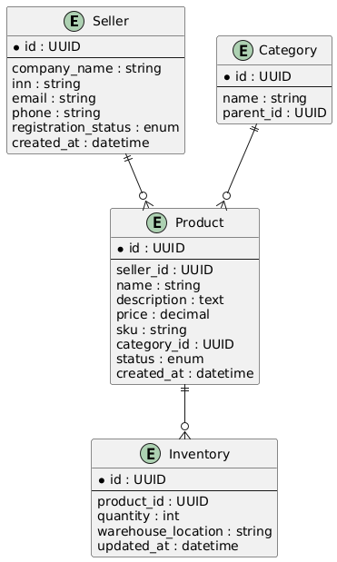

# Модель данных подсистемы продавцов

В данной модели описаны основные сущности, необходимые для функционирования подсистемы продавцов маркетплейса.

**Модель данных:**

[Открыть PUML-файл](https://github.com/Hilski/practice_ba/blob/main/data-model/db)

# Модель данных (табличное описание)

---

## Seller (Продавец)

| Поле                | Тип данных   | Описание                                      |
|---------------------|--------------|-----------------------------------------------|
| `id`                | UUID         | Уникальный идентификатор продавца             |
| `company_name`      | string       | Название компании                             |
| `inn`               | string       | ИНН                                           |
| `email`             | string       | Электронная почта                             |
| `phone`             | string       | Телефон                                       |
| `registration_status` | enum      | Статус регистрации: `pending`, `approved`, `rejected` |
| `created_at`        | datetime     | Дата создания записи                          |

---

## Product (Товар)

| Поле         | Тип данных | Описание                                           |
|--------------|------------|----------------------------------------------------|
| `id`         | UUID       | Уникальный идентификатор товара                   |
| `seller_id`  | UUID       | Внешний ключ на продавца                          |
| `name`       | string     | Название товара                                   |
| `description`| text       | Подробное описание                                |
| `price`      | decimal    | Цена                                              |
| `sku`        | string     | Уникальный артикул                                |
| `category_id`| UUID       | Категория товара                                  |
| `status`     | enum       | Статус: `draft`, `pending`, `approved`, `rejected`|
| `created_at` | datetime   | Дата добавления                                   |

---

## Inventory (Складской остаток)

| Поле               | Тип данных | Описание                                 |
|--------------------|------------|------------------------------------------|
| `id`               | UUID       | Уникальный идентификатор записи          |
| `product_id`       | UUID       | Внешний ключ на товар                    |
| `quantity`         | int        | Количество на складе                     |
| `warehouse_location`| string    | Расположение склада                      |
| `updated_at`       | datetime   | Дата последнего обновления               |

---

## Order (Заказ)

| Поле         | Тип данных | Описание                                |
|--------------|------------|-----------------------------------------|
| `id`         | UUID       | Уникальный идентификатор заказа         |
| `product_id` | UUID       | Заказанный товар                        |
| `buyer_id`   | UUID       | Идентификатор покупателя                |
| `quantity`   | int        | Количество                             |
| `status`     | enum       | Статус: `new`, `confirmed`, `shipped`, `delivered`, `canceled` |
| `ordered_at` | datetime   | Дата создания заказа                    |

---

## Buyer (Покупатель)

| Поле       | Тип данных | Описание                |
|------------|------------|-------------------------|
| `id`       | UUID       | Уникальный идентификатор|
| `full_name`| string     | Полное имя              |
| `email`    | string     | Почта                   |
| `phone`    | string     | Телефон                 |
| `address`  | string     | Адрес доставки          |

---

## Question (Вопрос к товару)

| Поле          | Тип данных | Описание                            |
|---------------|------------|-------------------------------------|
| `id`          | UUID       | Уникальный идентификатор вопроса    |
| `product_id`  | UUID       | Ссылка на товар                     |
| `buyer_id`    | UUID       | Ссылка на покупателя                |
| `question_text`| text      | Текст вопроса                       |
| `answer_text` | text       | Ответ продавца                      |
| `asked_at`    | datetime   | Дата вопроса                        |
| `answered_at` | datetime   | Дата ответа                         |

---

## Category (Категория)

| Поле       | Тип данных | Описание                           |
|------------|------------|------------------------------------|
| `id`       | UUID       | Уникальный идентификатор категории |
| `name`     | string     | Название категории                 |
| `parent_id`| UUID       | Родительская категория (nullable)  |

---