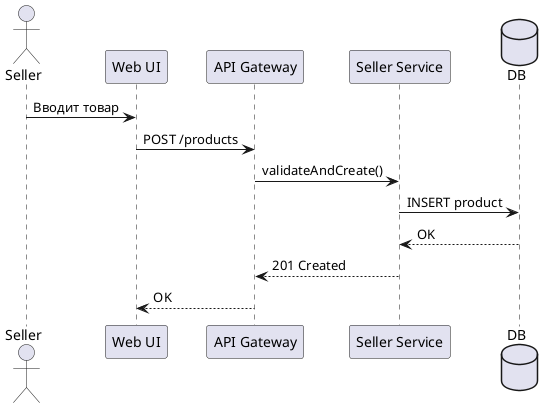
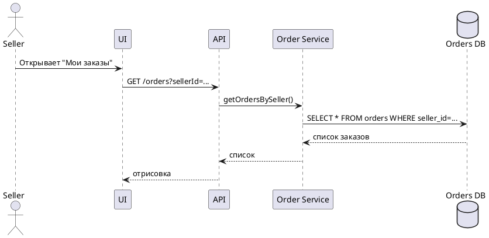

# 🔁 Взаимодействие компонентов

## Диаграмма 1: Создание карточки товара

```plantuml
@startuml
actor Seller
participant "Web UI" as UI
participant "API Gateway" as API
participant "Seller Service" as Service
database "DB" as DB

Seller -> UI : Вводит товар
UI -> API : POST /products
API -> Service : validateAndCreate()
Service -> DB : INSERT product
DB --> Service : OK
Service --> API : 201 Created
API --> UI : OK
@enduml
```

## Диаграмма 2: Получение списка заказов

```plantuml
@startuml
actor Seller
participant UI
participant API
participant "Order Service" as OS
database "Orders DB" as ODB

Seller -> UI : Открывает "Мои заказы"
UI -> API : GET /orders?sellerId=...
API -> OS : getOrdersBySeller()
OS -> ODB : SELECT * FROM orders WHERE seller_id=...
ODB --> OS : список заказов
OS --> API : список
API --> UI : отрисовка
@enduml
```