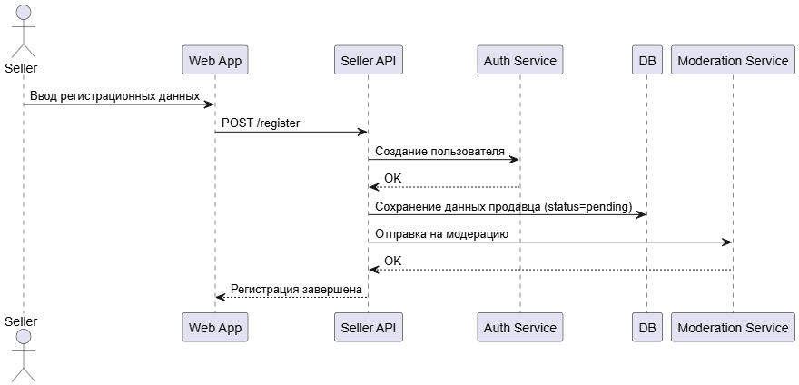
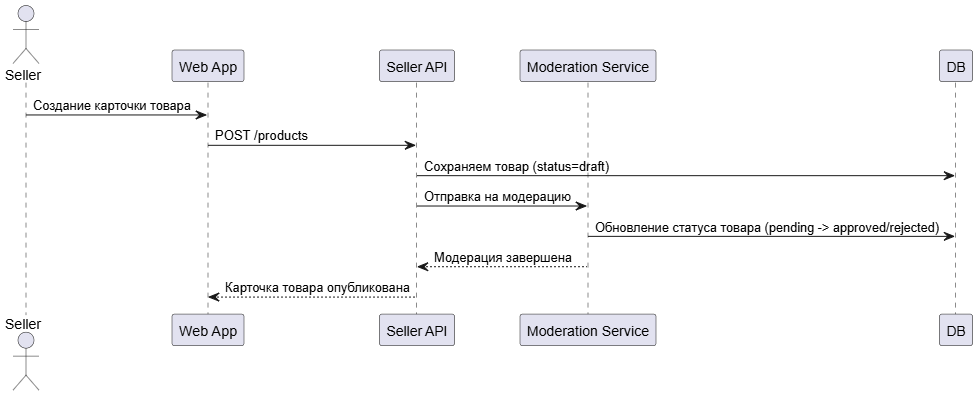
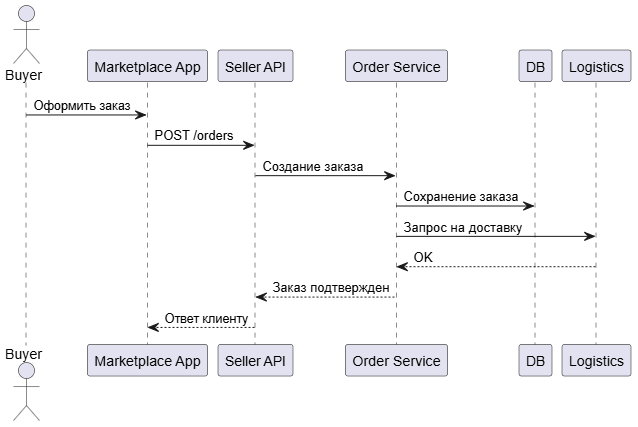

# Взаимодействие компонентов подсистемы продавцов

В данном разделе описаны основные сценарии взаимодействия между продавцом, API-сервисами, базой данных и внешними системами. Диаграммы представлены в формате PlantUML.

---

## Сценарий 1: Регистрация продавца

[Открыть PUML](https://github.com/Hilski/practice_ba/blob/main/interaction/Registration)

---

## Сценарий 2: Размещение и модерация карточки товара

[Открыть PUML](https://github.com/Hilski/practice_ba/blob/main/interaction/Publication)

---

## Сценарий 3: Обработка заказа

[Открыть PUML](https://github.com/Hilski/practice_ba/blob/main/interaction/Order)

---

## Примечания

- Все взаимодействия между сервисами происходят по REST и/или через Kafka.
- Аутентификация пользователя осуществляется через централизованный Auth Service.
- Статусы заказов и товаров обновляются асинхронно.
